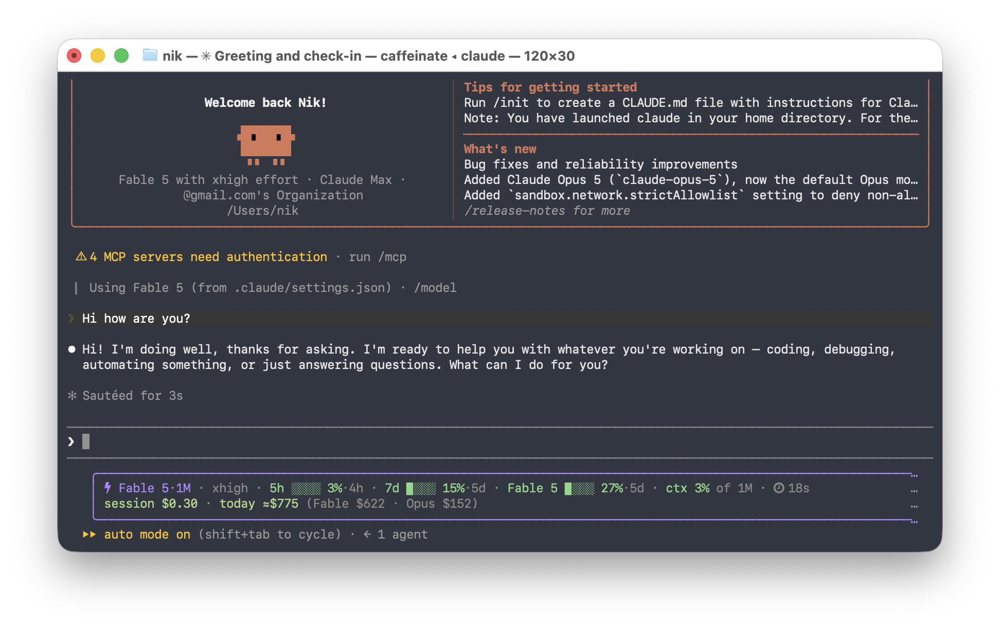

# Claude Code Usage Statusline

A single Bash script that turns the data Claude Code passes to a
[statusline](https://code.claude.com/docs/en/statusline) into two compact, colored
lines: **what's close to a limit** on top, **what it's costing** underneath — no API
key, no external server, nothing leaves your machine.\*



Quiet, because nothing needs your attention yet:

```
⚡ Opus 5·1M high  7d 34%  ctx 12%  ⏱ 12m
session $2.10 · today ≈$72.19 (Opus $38.66 · Fable $33.52) · month ≈$1,284
```

Loud, because two windows will run out before they reset:

```
⚡ Opus 5·1M high ⚡fast  ⚠ 5h ▉▉▉▉▉▉▉▉ 91%·39m  ⚠ 7d ▉▉▉▉▉▉▉░ 83%·2d  Fable 5 61%  ctx 12%  ⏱ 12m
session $2.10 · today ≈$72.19 · month ≈$1,284 · credits $12.40 of unlimited · ⚠ 5h limit in ~25m · ⚠ 7d limit in ~23h
```

Four [themes](#themes), every segment optional, and a wizard that previews each choice
with your real numbers before you commit to it:

```bash
bash ~/.claude/statusline-usage.sh --configure
```

<sub>\* One exception, off by default: the opt‑in [remote meter](#about-the-remote-meter-fable-5--usage-credits)
is the only part that makes a network call.</sub>

## Install

Requires `python3` (the script uses it to parse and format the JSON).

```bash
bash install.sh      # copies the script to ~/.claude/, registers it, asks what to show
```

Then open a **new** Claude Code session. The installer backs up any existing
`settings.json` and refuses to overwrite a different statusline you already use.
It asks a handful of questions the first time and skips them if a config already
exists; with no terminal attached (piped install, CI) it writes defaults instead of
blocking.

<details>
<summary>Manual install</summary>

Copy `statusline-usage.sh` to `~/.claude/statusline-usage.sh`, make it executable
(`chmod +x`), and add this to `~/.claude/settings.json`:

```json
{
  "statusLine": {
    "type": "command",
    "command": "~/.claude/statusline-usage.sh",
    "padding": 1
  }
}
```
</details>

## Configuration

```bash
bash ~/.claude/statusline-usage.sh --configure     # wizard, previews every choice
bash ~/.claude/statusline-usage.sh --preview       # all four themes side by side
```

`--configure` opens a **full-screen live editor** — no dependencies, no npm, just the
script itself. Arrow keys move, `←`/`→` change a value, `space` toggles a segment,
`K`/`J` move it up or down its line, `s` saves, `q` quits without writing, `r` resets
to defaults. The preview at the bottom is rendered by the real renderer **with your
real spend numbers** and updates on every keystroke, so you see exactly what each
toggle does before you commit to it:

```
 Claude statusline — configurator   ↑↓ move · ←→ change · space toggle · K/J reorder · s save · q quit
────────────────────────────────────────────────────────────────────────────────────────
  Theme          ‹ boxed ›
  Palette        ‹ ocean ›
  ...
    [x] model
    [x] effort
    [ ] title
────────────────────────────────────────────────────────────────────────────────────────
 preview — live, with your real spend numbers
 │ ⚡ Opus 5·1M │ high │ ⚠ 7d ▰▰▰▰▰▰▰▱ 83%·2d │ ctx 12% of 1M │ ⏱ 1h 11m │
 │ session $2.10 │ today ≈$227 (Opus $127 · Fable $99) │ month ≈$27,944 │
```

It writes `~/.claude/statusline-usage.conf`, which you can also edit by hand. Any key
can be overridden for a single session with the matching `CLAUDE_USAGE_<KEY>` env var
(**env beats the file, the file beats the defaults**):

| Key | Default | What it does |
|---|---|---|
| `THEME` | `plain` | `plain` · `boxed` · `dots` · `mono` · `badge` · `soft` · `rainbow` · `powerline` · `slant` · `capsule` · `frame` — see below |
| `PALETTE` | `default` | `default` · `ocean` · `sunset` · `forest` — recolors every theme; the green→amber→red meaning never changes |
| `ICONS` | `unicode` | `unicode` = ⚡ ⑂ ⏱ symbols that render in any font · `nerd` = native Nerd Font glyphs · `none` = text only. Also switches the powerline arrows/caps (see below) |
| `BAR` | `theme` | Meter bar style: `theme` (each theme's own) · `boxes` ▉░ · `slant` ▰▱ · `shade` █▒ · `line` ━╌ · `dots` ●○ · `mini` ▪▫ · `bars` ▮▯ · `ascii` #- · `dot` (a single colored ●) (`mono` always uses ascii) |
| `BARW` | `8` | Meter bar length in cells, 4–16 |
| `BAR_HEAT` | `0` | `1` colors bar cells by the zone they sit in — green below `NOTICE`, amber below `THRESHOLD`, red above — so the bar itself shows where the danger band starts. Sep themes only (plain/boxed/dots/frame); block themes color by background and ignore it. |
| `BUDGET_MONTH` / `BUDGET_DAY` | `0` | Your own $ targets. Non‑zero adds a `budget` meter — `budget ▉▉▉▉░░░░ 56%·4d $21,986 left` — with the same threshold colors, warnings and a runs‑out‑before‑reset projection as every other meter. This is the "don't cross the line at work" feature. |
| `CMD` / `CMD_TTL` | — / `30` | A command whose first stdout line becomes the `cmd` segment (e.g. `kubectl config current-context`). Runs detached in the background, cached for `CMD_TTL` seconds — a render never waits on it, a failing command simply doesn't render. It's your own command from your own config file, executed with your own shell privileges — same trust as `.bashrc`. |
| `RULE` | `0` | `1` draws a dim `─` rule as the last line — a visual boundary between this usage block and Claude Code's own footer below it |
| `LINES` | `2` | `1` folds the money into the status line |
| `STYLE` | `adaptive` | `adaptive` = show a meter only once it matters · `full` = always draw every bar · `compact` = numbers only |
| `THRESHOLD` | `80` | At or above this a meter turns red, gets a bar and a `⚠` |
| `NOTICE` | `50` | `adaptive` only: below this a meter is hidden |
| `SEGMENTS` | `model,effort,5h,7d,quota,ctx,time` | Line 1 contents, in order. Also available: `title`, `git`, `dir`, `pr`, `vim`, `agent`, or a bucket by name (`fable`, `opus`, `sonnet`) |
| `LINE2` | `session,today,models,month,credits,warn` | Line 2 contents, in order. Also available: `burn`, `spark`, `search`, `cache` |
| `GIT` | `branch` | `off` · `branch` (free) · `dirty` (also counts changed files) |
| `REMOTE` | `0` | Fetch per‑model quotas and the usage‑credit balance (see below) |
| `NOTIFY` | `off` | `off` · `threshold` (desktop notification on a crossing) · `all` (also when a limit is projected to run out) |

## Commands

```bash
statusline-usage.sh --configure                    # full-screen live editor
statusline-usage.sh --preview [theme] [palette]    # draw a sample line
statusline-usage.sh --doctor [--net]               # why isn't something showing up?
statusline-usage.sh --report [--days N] [--json|--csv]
statusline-usage.sh --save-preset work             # snapshot the current config
statusline-usage.sh --preset work                  # activate a snapshot
statusline-usage.sh --presets                      # list snapshots
```

Presets are plain config files in `~/.claude/statusline-presets/` — switch between a
work setup, a home setup and a demo setup without re-clicking anything. Inside the
configurator, `p` cycles through them live and `P` saves the current state under a
new name.

`--doctor` checks the config (and the values actually in effect after env overrides),
whether `statusLine` is registered and points here, transcript and cache state, whether
an OAuth token can be found **and never prints it**, git detection, and finally draws
every glyph the themes use so you can see which ones your font renders. It makes no
network call unless you pass `--net`.

`--report` prints the spend history straight out of the cache — per day, per model, with
tokens, searches and cache hit rate; `--report --projects` splits the same window per
project instead. `--json` and `--csv` are there for when someone asks for a monthly
number:

```
day           Fable    Opus    total  searches  cache_pct      tokens
2026-07-20  2072.66    1.43  2074.09         0       99.1  1503802326
2026-07-27    38.48  116.95   155.43         0       98.8   195213874

month to date ≈$27,873 · last 7 days ≈$193/day · 5 active days in the last 8
```

## Themes

Eight themes, all previewable with `--preview` and switchable live in the configurator:

```
plain      ⚡ Opus 5·1M high  ⚠ 7d ▉▉▉▉▉▉▉░ 83%·2d  ctx 12% of 1M  ⏱ 1h 11m
boxed      │ ⚡ Opus 5·1M │ 7d 44% │ ⑂ main !3 │ 📁 statusline │ ctx 39% of 200k │
dots       ⚡ Opus 5·1M · 7d 44% · ctx 12% of 1M · ⏱ 1h 11m
mono       Opus 5-1M | ! 7d #######- 83%-2d | ctx 12% of 1M | 1h 11m
badge      colored blocks with inverse text — the boxed-screenshot look, in any font
soft       one dark band, segments as colored text with ╱ separators — starship's
           "classic" look, any font, immune to minimum-contrast terminal features
rainbow    a train of palette-cycling blocks with ╱ cuts — starship's "rainbow"
           look, any font (backgrounds are decorative; meters keep their meaning
           through the ⚠ and the percentage)
powerline  block train: hard color edges in any font,  arrows with a Nerd Font
slant      block train with ╱ cuts in any font,  edges with a Nerd Font
capsule    each segment its own pill:  caps with a Nerd Font, wider pills without

frame      ╭──────────────────────────────────────────────╮
           │ ⚡ Opus 5·1M · ⚠ 7d ▰▰▰▰▰▰▰▱ 83%·2d · ctx 12% │
           │ session $2.10 · today ≈$127 · month ≈$28,088 │
           ╰──────────────────────────────────────────────╯
```

`frame` draws a real rounded box around the whole block, stretched to the terminal
width; its bottom border doubles as the `RULE` separator, so `RULE` is ignored there.

**Nothing renders tofu by default.** Icons are their own axis (`ICONS`), and the default
`unicode` set renders in any font — including the powerline family's separators, which
fall back to characters every font has:

| Theme | `ICONS=nerd` (native) | `ICONS=unicode` (default) |
|---|---|---|
| powerline | `` / `` arrows, pointed tail | **hard edges** — the colored blocks butt directly against each other, `│` thin separator, flat ends |
| slant | `` / `` edges | `╱` cuts drawn on the next block's background (box‑drawing — full‑cell in every monospace font), flat ends |
| capsule | `` … `` round caps | no caps — just wider pills (double padding) |
| badge / soft / rainbow | — | pure backgrounds/text, nothing font-dependent |

The fallbacks deliberately use **only characters with cell metrics** (box‑drawing and
backgrounds). Geometric shapes like `▶ ◣ ▐ ▌` render with symbol metrics in many
fonts — smaller than the cell, baseline‑aligned — which shows up as notches and
floating triangles; they are gone from the fallback path entirely. If you want the
pointed powerline look, install a Nerd Font and set `ICONS=nerd`.

So `capsule` without a Nerd Font gives you square-edged pills instead of boxes of tofu,
and `ICONS=nerd` is the explicit opt-in once you've installed the font. Palettes are an
independent axis: `PALETTE=ocean` recolors any theme (`mono` stays colorless and iconless
whatever `ICONS` says).

`boxed` stretches to the terminal edge, because Claude Code passes `COLUMNS` to the
statusline command. That also drives **width‑aware fitting**: when the line doesn't fit,
segments are dropped least‑important‑first (`spark → title → dir → search → burn →
time → pr → git → …`) and, in the last resort, the line is clipped with `…`. The model,
the meters and the warnings are never dropped — they're the reason the line exists.
Nothing ever wraps onto a second row.

### Adaptive levels

The point of `adaptive` is that a statusline you stop reading is worthless. A meter
gets more ink the closer it is to hurting you:

| Where the meter is | How it's drawn |
|---|---|
| below `NOTICE` | hidden |
| `NOTICE` … `THRESHOLD` | number only — `7d 63%` |
| at or above `THRESHOLD` | full — `⚠ 7d ▉▉▉▉▉▉▉░ 83%·2d` |

If nothing is above `NOTICE`, the highest meter is still shown as a bare number, so
the line is never completely blind about your quota.

## What each part means

**Line 1 — where you stand**

| Segment | Source | Meaning |
|---|---|---|
| `color override debugging` | `session_name` | The session title you set with `/rename`. Truncated, and the first thing dropped on a narrow terminal. |
| `⚡ Opus 5·1M` | `model.id` | Current model, colored per family (Opus / Sonnet / Haiku / Fable), with version and a `·1M` tag when running with the 1M‑token context window. |
| `high` | `effort.level` | Reasoning effort (`low`/`medium`/`high`/`xhigh`/`max`). Omitted when the model doesn't support it. |
| `⚡fast` | `fast_mode` | Fast mode is on — worth noticing, it's **double** the per‑token price. |
| `5h … %·39m` | `rate_limits.five_hour` | Your **5‑hour** subscription usage and the countdown to reset. |
| `7d … %·2d` | `rate_limits.seven_day` | Your **7‑day (weekly)** subscription usage and reset countdown. |
| `Fable 5 … %·6d` | `/api/oauth/usage` | **Opt‑in.** Per‑model weekly windows. `quota` shows every bucket your account has (Fable 5, Opus, Sonnet…); naming one shows just that one. |
| `⑂ main !3 +1 ↑2↓1` | `.git/HEAD` + `git status` | Branch, changed files (`!`), staged files (`+`), and commits ahead/behind upstream (`↑↓`) — each part only when non‑zero. The branch is read straight from `.git/HEAD` — no subprocess, no cost. The counts need one `git status --porcelain -b`, so they refresh in the background keyed on the index mtime; `GIT=branch` skips them entirely. |
| `vim NORMAL` | `vim.mode` | Vim editor mode — only present when vim mode is on. Amber outside INSERT. |
| `code-architect` | `agent.name` | Agent name when Claude Code runs with `--agent`. |
| `📁 statusline` | `workspace.repo` / `project_dir` | Which project this window is in. |
| `#42 ✓` | `pr.{number,review_state}` | Open PR for the branch, same data as Claude Code's own footer badge. |
| `ctx 39% of 200k · compact in ~8k` | `context_window` | How much of the context window is used, how big it is, and — once you're close — how many tokens are left before Claude Code compacts the conversation (see below). |
| `⏱ 1h 11m` | `cost.total_duration_ms` | Wall‑clock time since this session started. |

**Line 2 — what it costs**

| Segment | Source | Meaning |
|---|---|---|
| `session $2.10` | `cost.total_cost_usd` | Cost of **this** session, as reported by Claude Code. |
| `today ≈$72.19` | local transcripts | Estimated total across **all** local sessions today (see below). |
| `(Opus $38.66 · Fable $33.52)` | local transcripts | Today split by model family — Fable costs 2× Opus per token, so the split is usually the interesting part. |
| `month ≈$1,284` | local transcripts | Month to date, same reconstruction. |
| `≈$88/h` | local transcripts | Burn rate from hourly buckets: the current hour extrapolated once it has ten minutes of signal, otherwise the last complete one. |
| `eom ≈$32,750` | computed | Straight-line month-end forecast from the pace so far (hidden in the first two days of a month). Red — plus a `projected over budget` warning — when it beats `BUDGET_MONTH`, which tells you you're heading over **before** it happens. |
| `top …usage-statusline $336` | local transcripts | The most expensive project today — transcripts already live in per-project folders, so this costs nothing extra. `--report --projects` gives the full table. |
| `█▃▁▁▁▂▂` | local transcripts | Last seven days of spend, oldest first — one glance tells you whether today is normal. |
| `🔍 250` | `usage.server_tool_use` | Web searches today. They're billed per request (~$10/1k) **on top of tokens**, and are included in the totals above. |
| `cache 94%` | local transcripts | Share of input tokens served from the prompt cache. High is good, so the colors are inverted — a low number means you're paying full price for context that could have been cached. |
| `credits $12.40 of unlimited` | `/api/oauth/usage` | **Opt‑in.** Usage credits burned this month — real money, beyond the subscription. |
| `⚠ 5h limit in ~25m` | computed | At the pace used so far, this window runs out **before** it resets (see below). |

### Will I run out before it resets?

That's the question the `⚠ … limit in ~25m` warnings answer. For each window the
script knows the length (5 h, or 7 days) and when it resets, so it knows how much of
the window has elapsed and how much quota went with it:

```
elapsed   = window − time_to_reset
eta       = elapsed × (100 − used%) / used%
```

If `eta` lands before the reset, you're on track to hit the wall and the warning
appears. Nothing is drawn during the first 10 % of a window — right after a reset
every burst looks like an emergency.

Up to two warnings are shown, worst first: limit already reached → credits over
threshold → auto‑compact approaching → soonest projected limit.

### Will the conversation be compacted?

Claude Code compacts when `input + cache_creation + cache_read` reaches

```
context_window − min(max_output_tokens, 20 000) − 13 000
```

and every current model has a max output of at least 20k, so in practice the trigger is
**`context_window_size − 33 000`** — 167k on a 200k window, 967k on a 1M one. (That second
number matches Claude Code's own internal table, which is how the formula was confirmed
rather than guessed.) The `ctx` segment starts showing `compact in ~8k` inside the last
20 000 tokens — the same band Claude Code uses for its own warning — and a matching line‑2
warning appears with it.

### Desktop notifications

`NOTIFY=threshold` fires a desktop notification (macOS `osascript`, Linux `notify-send`)
when something **crosses** a threshold — a limit, the credit balance, or the context
nearing auto‑compact. It fires on the transition, not on the state: once the value drops
back below, the alert re‑arms, and while it stays above you get at most one per ten
minutes. Delivery is detached, so it can never hold up a render, and `--preview`,
`--report` and `--doctor` never notify. `NOTIFY=all` also warns when a window is
projected to run out before it resets.

### About `today ≈$` and `month ≈$`

Claude Code only gives the statusline the **current** session's cost. To show a real
daily and monthly total, the script reads your local transcripts under
`~/.claude/projects/*/*.jsonl` and reconstructs per‑message cost from token usage
(input/output/cache × per‑model rates), grouped by local day and model family.

Transcripts are append‑only, so the cache stores a **byte offset** per file and each
render parses only what was appended since the last one. That matters: a long session's
transcript reaches tens of megabytes, and re‑reading it on every render costs ~500 ms —
the tail parse costs ~5 ms. The first run after an upgrade re‑reads everything once.

Fast mode is priced correctly: messages carry `usage.speed`, and on the models that
support it fast mode bills at **double** the standard rate ($10/$50 per Mtok on Opus 5
instead of $5/$25). Web searches are counted too — they're billed per request on top of
tokens, so a search‑heavy day is more expensive than its token count suggests.

Important:
- It's an **estimate at published API list prices** (hence `≈`). On **Pro/Max** plans
  you pay a flat subscription, so this is a notional API‑equivalent figure, **not an
  actual bill** — but it is exactly the figure that tells you what the same work would
  cost once usage spills onto credits.
- It counts only **local Claude Code** sessions — it does **not** include claude.ai
  web usage or other machines.

### About the remote meter (Fable 5 + usage credits)

Claude Code puts only `five_hour` and `seven_day` into the statusline payload. Per‑model
weekly windows — the ones `/usage` shows, e.g. **Fable 5** — and the usage‑credit balance
are simply not in the data the statusline receives, at any version. The only way to show
them is to ask the same endpoint `/usage` reads, so this is **opt‑in and off by default**:

```bash
export CLAUDE_USAGE_REMOTE=1    # or REMOTE=1 in the config file
```

It adds two things: the **Fable 5** weekly meter on line 1, and **usage credits** on
line 2 — how much real money has been spent beyond the subscription this month
(`$12.40 of unlimited`, or `$12.40/$50 (25%)` when your plan caps it, or `credits off`
when spillover isn't possible at all). If your plan denominates the weekly window in
dollars, `$X left this week` is shown too — Claude Code itself ignores those fields.

How it behaves when enabled:

- **It never blocks a render.** The statusline always draws the last cached reading
  (~0 ms). When that reading is older than 120 s, a detached background process
  refreshes it for the *next* render. The numbers therefore appear one render late on a
  cold start, and can be up to ~2 minutes behind — irrelevant for a weekly window.
- **It reads your existing Claude Code OAuth token; it never refreshes it.** The token is
  read from `~/.claude/.credentials.json`, or from the macOS Keychain
  (`Claude Code-credentials`) when that file doesn't exist — the first Keychain read
  prompts once. Running the refresh flow ourselves could rotate the token out from
  under the live Claude Code session, so the script deliberately doesn't.
- **The token is never written anywhere and never passed on a command line.** It goes
  straight into the request headers; `ps` can't see it. The cache
  (`~/.claude/.usage-remote-cache.json`, mode `0600`) holds percentages, dollar amounts
  and reset times — nothing else.
- **The only host contacted is `api.anthropic.com`** — the same one Claude Code already
  talks to. It's a `GET` with no body: it reads your own usage and sends nothing about
  your code, prompts, or session.
- **Every failure is silent.** No token, expired token, timeout, changed response shape
  — the segments just don't render and the rest of the statusline is unaffected.
  Failures back off (5 min; 15 min on `401`/`403`), and a reading nobody has managed to
  refresh for 30 minutes stops being drawn rather than showing a stale number as current.
- Set `CLAUDE_USAGE_REMOTE_DEBUG=1` to dump the raw response to
  `~/.claude/.usage-remote-debug.json` once, if you want to see what the endpoint returns.

The trade‑off worth knowing: `/api/oauth/usage` is a private, undocumented endpoint. It
can change without notice, and if it does, these segments quietly disappear until the
parsing is updated. Everything else in the script keeps working.

### New models

The model segment is future‑proof — you rarely need to touch the script when Anthropic
ships a new model:

- **A new version of a known family** (e.g. `claude-opus-5`, `claude-sonnet-6`) works
  automatically: right family color, and the version is parsed from the id.
- **A brand‑new family** (a new name) still renders automatically — the label comes from
  Claude Code's `model.display_name`, the version from the id, and it gets a neutral default
  color. To give it a dedicated color, add one line to `MODEL_COLORS` (and, optionally, one
  `elif` for the family key).
- **Pricing** for the `today ≈$` estimate falls back to a default rate for an unrecognized
  model until you add its rate to `model_rates()` — API prices aren't part of the statusline
  data, so they can't be detected automatically.

## Notes & limitations

- `rate_limits` only appear for **Pro/Max** subscribers and only **after the first
  reply** in a session. Until then the statusline shows the model plus a short
  `usage n/a` hint.
- The `5h` and `7d` figures are **account‑wide** (shared across claude.ai, Claude
  Desktop, and Claude Code) — not per‑session — and only range **0 → 100%**. There is
  **no "how far over the limit"** value, and **no "extra/overage tokens beyond your
  plan"** value, because Claude Code does not send those to the statusline.
- **Per‑model quotas and credit balances are not in the statusline payload.** Claude Code
  builds it from `five_hour` and `seven_day` only — there is no `seven_day_opus`,
  `seven_day_sonnet`, per‑model bucket or `extra_usage` to read, no matter how you parse
  it. The opt‑in [remote meter](#about-the-remote-meter-fable-5--usage-credits) works
  around this by asking the endpoint `/usage` reads.
- The projection is a **straight‑line estimate**: it assumes the rest of the window looks
  like the part you've already used. A quiet afternoon or an overnight batch will move it.
- Symbol widths differ between terminals. Width fitting assumes the common case (emoji
  double‑width, box drawing single); an unusual font may leave a column of slack.
- `git status` for the dirty count runs in the background and is keyed on the index
  mtime, so the number can lag by one render after you save a file. `GIT=branch` avoids
  running git at all.
- Everything runs locally; no data is collected or transmitted anywhere, unless you
  explicitly enable the [remote meter](#about-the-remote-meter-fable-5--usage-credits).

## Files

| File | Role |
|------|------|
| `statusline-usage.sh` | The statusline script (Bash wrapper around inline `python3`), plus `--configure`. |
| `install.sh` | One‑command installer; runs the configuration picker. |
| `README.md` | This file. |
| `screenshot.png` | Demo screenshot used above. |
| `LICENSE` | MIT license. |

## License

MIT — see [LICENSE](LICENSE).
